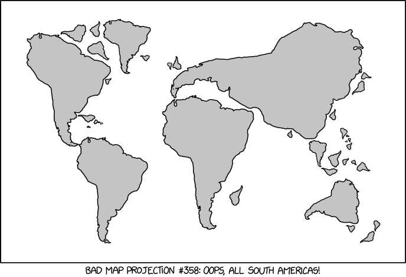

In this assignment, I will be looking at subareas (countries) within the continent of South America.





```{r, results='hide', message=FALSE, warning=FALSE}
# Load relevant packages
library(ggplot2)
library(sf)
library(rnaturalearth)
library(rnaturalearthdata)
library(tidyverse)
library(ggspatial)
library(cartogram)
library(ggthemes)
```


After loading the necessary packages, I created a simple map of South America, shown below. This uses data from the `rnaturalearth` package to draw borders. I actually don't want this to count as one of my projections, but would like to use it to demonstrate a potential limitation of this package.


```{r, s america map, message=FALSE}
# Create object for South American countries and plot
sa_countries <- ne_countries(scale = 50, continent = "South America", returnclass = "sf") 

sa_map <- ggplot(sa_countries) +
  geom_sf() + 
  theme_bw()

sa_map +
  annotation_scale()
```


Things look pretty good. However, it appears the the entries under "South America" do not include French Guiana. As we can see below, it's actually categorized in `rnaturalearth` as France. (which is correct; it's even part of the EU!)


```{r, france map, message = FALSE}
# Map of France, showing overseas departments
fra <- ne_countries(scale = 50, country = "France", returnclass = "sf")

fra_map <- ggplot(fra)+
  geom_sf() +
  theme_bw()

fra_map
```


For comparing projections though, I do want to include all of South America, and incorporated French Guiana into my plot.


```{r, complete SA map}
# Combining sf objects in ggplot for complete South America map
fr_gui <- ne_states(country = 'france', returnclass = "sf") %>%
  filter(name_en == "French Guiana")

sa_map_complete <- ggplot() +
  geom_sf(data = sa_countries) +
  geom_sf(data = fr_gui) +
  theme_bw()

sa_map_complete

```


Success! 

# Projection 1: UTM

The first projection I wanted to explore was a Universal Transverse Mercator, centered over Chile. (zone 19S, found on spatialreference.org) The farther away from the central meridian one looks, the more that cardinal directions and latitudinal distance become distorted. This seems like it could work well for relatively "narrow" countries. 


```{r, Chile projection}
# Mapping South America with UTM projection
chl_pro <- "+proj=utm +zone=19 +south +ellps=aust_SA +towgs84=-67.35,3.88,-38.22,0,0,0,0 +units=m +no_defs"

ggplot() +
  geom_sf(data = sa_countries) +
  geom_sf(data = fr_gui) +
  coord_sf(crs = chl_pro) +
  theme_stata()

```


# Projection 2: AEA Conical


Next up is an equal-area projection centered above Brazil. (also from spatialreference.org) This seems to do a better job preserving area and direction (or at least the coordinate grid appears more parallel). At the same time, shapes are a bit distorted (stretched horizontally), especially at the northern and southern extents of the map.


```{r, Brazil aea}
# Mapping South America with AEA projection
brz_pro <- "+proj=aea +lat_1=-2 +lat_2=-22 +lat_0=-12 +lon_0=-54 +x_0=0 +y_0=0 +ellps=aust_SA +units=m +no_defs"


ggplot() +
  geom_sf(data = sa_countries) +
  geom_sf(data = fr_gui) +
  coord_sf(crs = brz_pro) +
  theme_stata()
```


# Projection 3: A Bad Idea


Lastly, we can see what happens when using a projection that is intended for a totally different part of the world. This is the Washington State plane projection from the written tutorial. Obviously, this does a poor job of preserving anything of value for this map, but it is kind of funny! 


```{r, wa state plane}
# Dumb projection
wa_pro <- "+proj=lcc +lat_1=47.5 +lat_2=48.73333333333333 +lat_0=47 +lon_0=-120.8333333333333 +x_0=500000 +y_0=0 +ellps=GRS80 +units=m +no_defs"


ggplot() +
  geom_sf(data = sa_countries) +
  geom_sf(data = fr_gui) +
  coord_sf(crs = wa_pro) +
  theme_stata()

```


# Representing a Variable


I have decided to look at rates of COVID-19 in South America. Unfortunately, data for French Guiana is usally reported with France (I checked several places), so I will have to leave it out.

```{r, import WHO data}
# importing and joining WHO covid-19 data to existing country dataframe
covid_data <- read.csv(file = "WHO-COVID-19-global-data.csv")

covid_sa <- sa_countries %>%
  left_join(covid_data, by = c("name_long" = "Country")) %>%
  mutate(case_100k = 100000 * New_cases / pop_est) %>%
  select(name_long, pop_est, case_100k, New_cases, Cumulative_cases, New_deaths, Cumulative_deaths)
```

```{r, rates of covid}
# plotting rates of COVID
ggplot(covid_sa, aes(fill = case_100k)) +
  geom_sf(color = NA) +
  coord_sf(crs = brz_pro) +
  theme_map()
```

```{r, rates of covid2}
# plotting rates of COVID, again
ggplot(covid_sa, aes(fill = case_100k)) +
  geom_sf(color = NA) +
  coord_sf(crs = brz_pro) +
  theme_map()
```